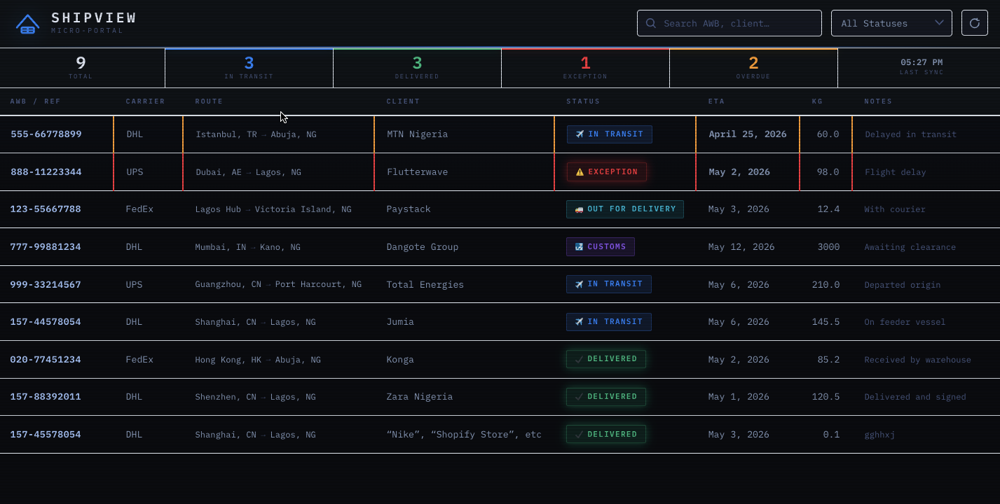

# ShipView Micro-Portal — WordPress Plugin

A dedicated shipment tracking control-room portal for WordPress.
No page-builder required. Pure PHP + CSS + Vanilla JS.

---

## Features

| Feature | Detail |
|---|---|
| **Custom Post Type** | `shipment` CPT with AWB, carrier, status, ETA, origin, destination, client, weight, notes |
| **REST API** | `GET /wp-json/shipview/v1/shipments` — public read, auth-protected write |
| **Auto-refresh** | Client-side `fetch()` every 30 minutes with visible countdown |
| **Control-Room UI** | Full-page dark theme, IBM Plex Mono, scan-line texture, status badges |
| **Stats strip** | Total / In Transit / Delivered / Exception / Overdue counts |
| **Live search** | Client-side filter by AWB, client, carrier, origin, destination |
| **Status filter** | Dropdown to filter by status (All / Pending / In Transit / …) |
| **Detail drawer** | Click any row to slide open a full detail panel |
| **Admin columns** | AWB, carrier, status (colour-coded), ETA (red if overdue), client, destination |
| **Settings page** | Tools → ShipView shows portal URL and REST endpoint |

---

## Installation

1. Copy the `shipview-portal` folder into `wp-content/plugins/`
2. Activate via **Plugins → Installed Plugins**
3. A page called **"Shipment Tracker"** is created automatically at `/shipment-tracker/`
4. Go to **Shipments → Add New** to start entering AWBs

---

## Directory Structure

src/
├── Plugin.php                  ← bootstrap / service container
├── Support/
│   ├── Registerable.php        ← interface every service must implement
│   └── Activator.php           ← activation-only logic, loaded once
├── PostType/
│   ├── ShipmentPostType.php
│   └── MetaBox.php
├── RestApi/
│   ├── ShipmentController.php  ← HTTP layer only
│   ├── ShipmentRepository.php  ← all WP_Query / DB logic
│   └── ShipmentDTO.php         ← immutable value object
├── Admin/
│   ├── AdminColumns.php
│   └── SettingsPage.php
└── Frontend/
    ├── AssetLoader.php
    └── TemplateLoader.php

---

## REST API

### GET all shipments
```
GET /wp-json/shipview/v1/shipments
GET /wp-json/shipview/v1/shipments?status=in_transit
GET /wp-json/shipview/v1/shipments?search=DHL
```

**Response:**
```json
{
  "shipments": [
    {
      "id": 42,
      "title": "Shipment – Lagos Run 01",
      "awb": "157-12345678",
      "carrier": "DHL",
      "status": "in_transit",
      "eta": "2025-08-20",
      "eta_human": "August 20, 2025",
      "overdue": false,
      "origin": "Shanghai, CN",
      "destination": "Lagos, NG",
      "client": "Acme Corp",
      "weight": "145.5",
      "notes": "Cleared port, on feeder vessel",
      "updated": "2025-08-15T09:30:00+01:00"
    }
  ],
  "stats": {
    "total": 12,
    "in_transit": 5,
    "delivered": 4,
    "exception": 1,
    "overdue": 2
  },
  "generated": "2025-08-15T10:00:00+01:00",
  "count": 12
}
```

### GET single shipment by AWB
```
GET /wp-json/shipview/v1/shipments/157-12345678
```

### PATCH update status/notes (requires auth)
```
PATCH /wp-json/shipview/v1/shipments/42
X-WP-Nonce: <nonce>

{ "status": "delivered", "notes": "Signed by John Doe" }
```

---

## Shipment Statuses

| Key | Label |
|---|---|
| `pending` | ⏳ Pending |
| `in_transit` | ✈ In Transit |
| `customs` | 🛃 Customs |
| `out_for_del` | 🚚 Out for Delivery |
| `delivered` | ✔ Delivered |
| `exception` | ⚠ Exception |
| `returned` | ↩ Returned |

---

## Customisation

- **Refresh interval**: Change `refreshMs` in `shipview-portal.php` (default: `30 * 60 * 1000` ms)
- **Colour scheme**: Edit CSS custom properties in `assets/css/shipview.css` (`:root` block)
- **Logo**: Replace the inline SVG in `templates/tracking-page.php`
- **Access control**: To make the REST endpoint private, replace `'permission_callback' => '__return_true'` with a capability check in `includes/rest-api.php`

---

## Requirements

- WordPress 6.0+
- PHP 8.0+
- No additional plugins required

## 🖼️ Visual Preview
| Front Page Overview  SHIPVIEW MICRO-PORTAL Plugin |
|  |


